# Procesverslag
**Auteur:** -Tugce Bakim-

Markdown cheat cheet: [Hulp bij het schrijven van Markdown](https://github.com/adam-p/markdown-here/wiki/Markdown-Cheatsheet). Nb. de standaardstructuur en de spartaanse opmaak zijn helemaal prima. Het gaat om de inhoud van je procesverslag. Besteedt de tijd voor pracht en praal aan je website.

## Bronnenlijst
1. https://www.made.com/nl/
2. https://cssreference.io/
3. https://css-tricks.com/css-only-carousel/
4. https://css-tricks.com/responsive-images-css/
5. https://www.w3schools.com/howto/howto_css_dropdown_navbar.asp
6. https://developer.mozilla.org/en-US/docs/Web/HTML/Element/details
7. https://www.w3schools.com/howto/howto_js_slideshow.asp
8. https://www.w3schools.com/html/html_links.asp

## Eindgesprek (week 7/8)

-dit ging goed & dit was lastig-

**Screenshot(s):**

-screenshot(s) van je eindresultaat-

## Voortgang 3 (week 6)

-dit ging goed & dit was lastig-  
Ik heb wat meer content toegevoegd aan de website. Ik krijg het logo niet in het midden en ook zien de bovenste icoontjes er nog een beetje gek uit. Verder heb ik geprobeerd en draggable click slider te maken, ook is dit nog niet helemaal gelukt.
En de eerste image is ook niet meer helemaal responsive.

**Screenshot(s):**

-screenshot(s) van hoe ver je bent met korte uitleg- 
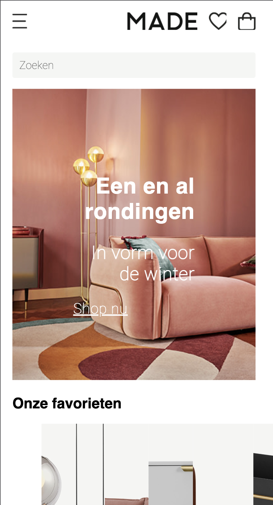 
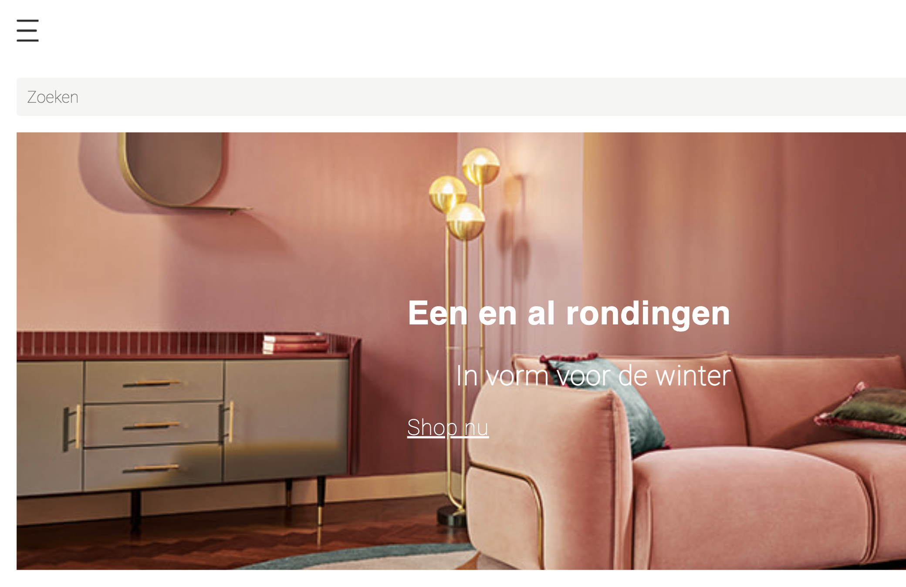 
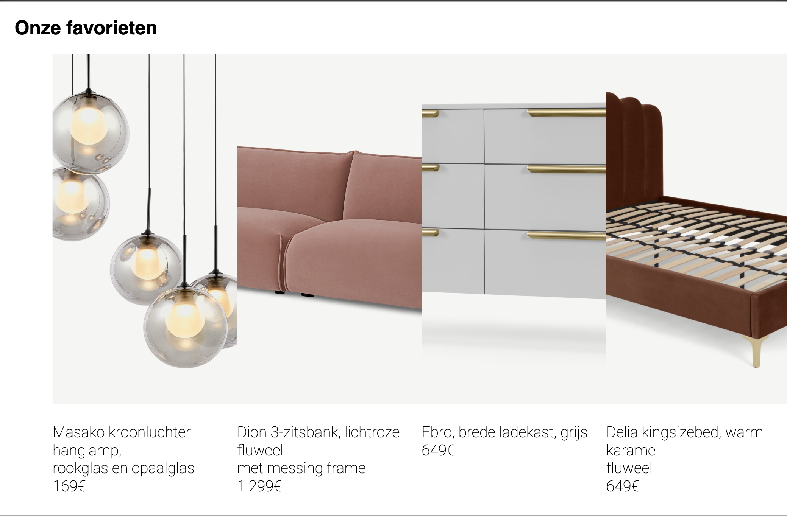 
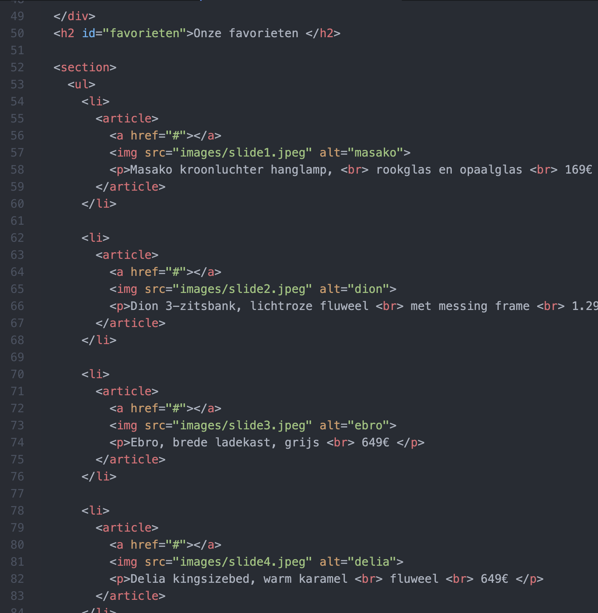 

## Voortgang 2 (week 5)
Ik was er nog niet helemaal uitgekomen met de code nadat ik heel veel dingen heb moeten verwijderen uit de css. Tijdens de les ga ik om hulp vragen hierover.

### Stand van zaken

-dit ging goed & dit was lastig-  
Na de les van vorige week ben ik niet veel verder gekomen. Wel heeft het enorm geholpen toen Joost
ging meekijken en de code kon aanpassen met hulp. De website is nu, voor zo ver er op staat, relative.

**Screenshot(s):**

-screenshot(s) van hoe ver je bent met korte uitleg- 
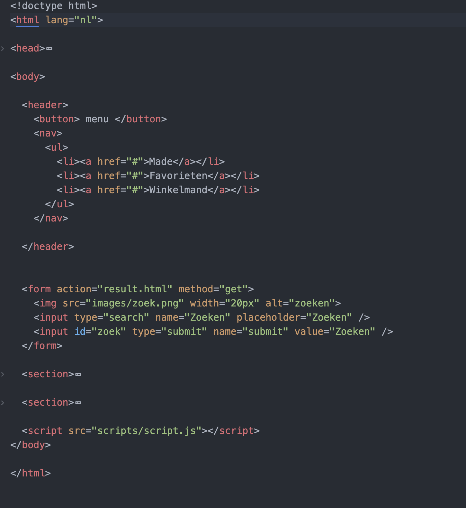 
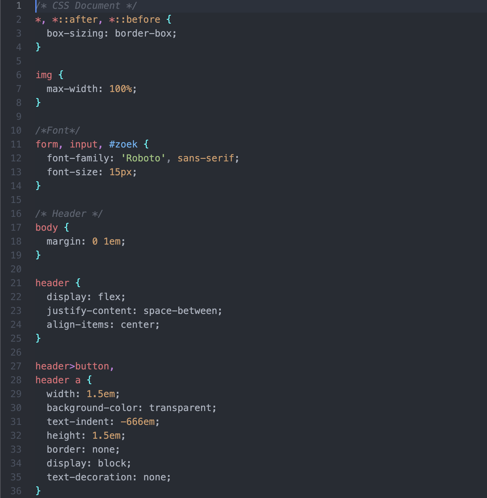 
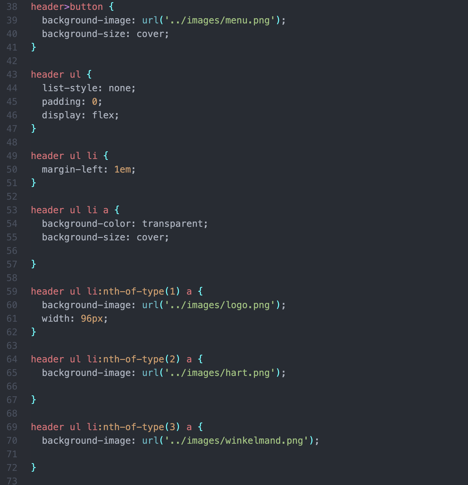 
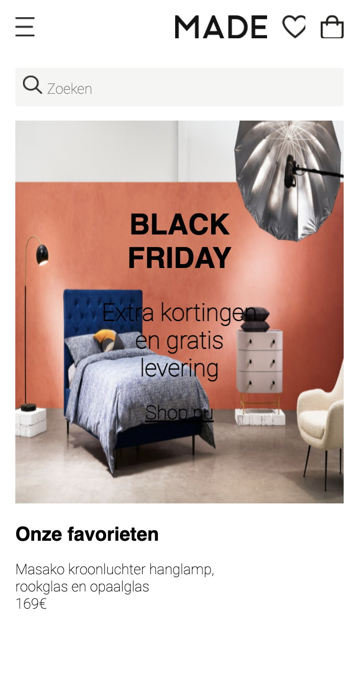 

## Voortgang 1 (week 3)
Mijn code was niet helemaal correct opgebouwd blijkbaar. Sam vertelde dat ik een UL van mijn navigatie kon maken en in mijn CSS alle left
en top kan weghalen. Ook dat ik bij de foto's geen position relative hoef te zetten. Ook had ik nog geen header in mijn body.
Na het aanpassen van alle notities die ik had gemaakt na het gesprek, klopte mijn code niet meer en zag alles er raar uit. Ik had de oude code niet meer
dus heb wel geprobeerd alles een beetje terug te zetten.

### Stand van zaken

-dit ging goed & dit was lastig-  
De header tot het eerste section ging het opzicht prima. Echter heb ik nog
vragen over hoe ik het beste kan werken met de sections en hoe ik ze goed onder
elkaar krijg.

**Screenshot(s):**

-screenshot(s) van hoe ver je bent met korte uitleg- 
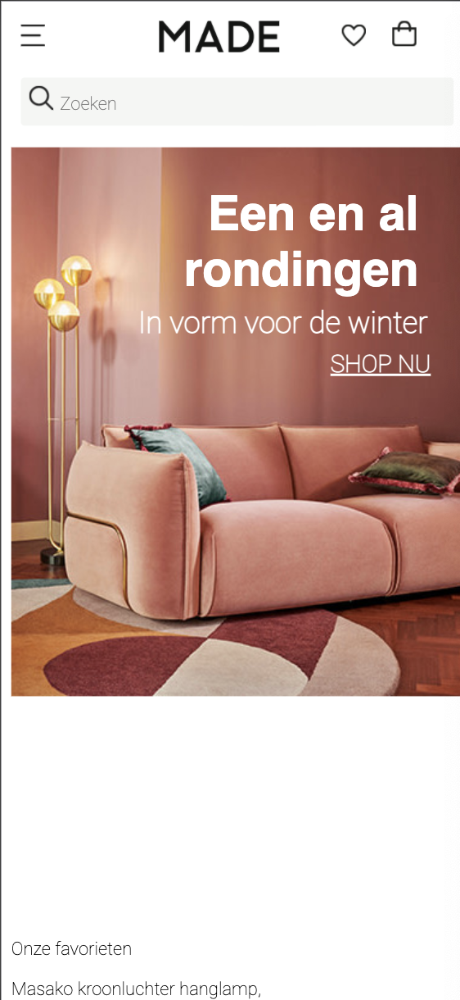 
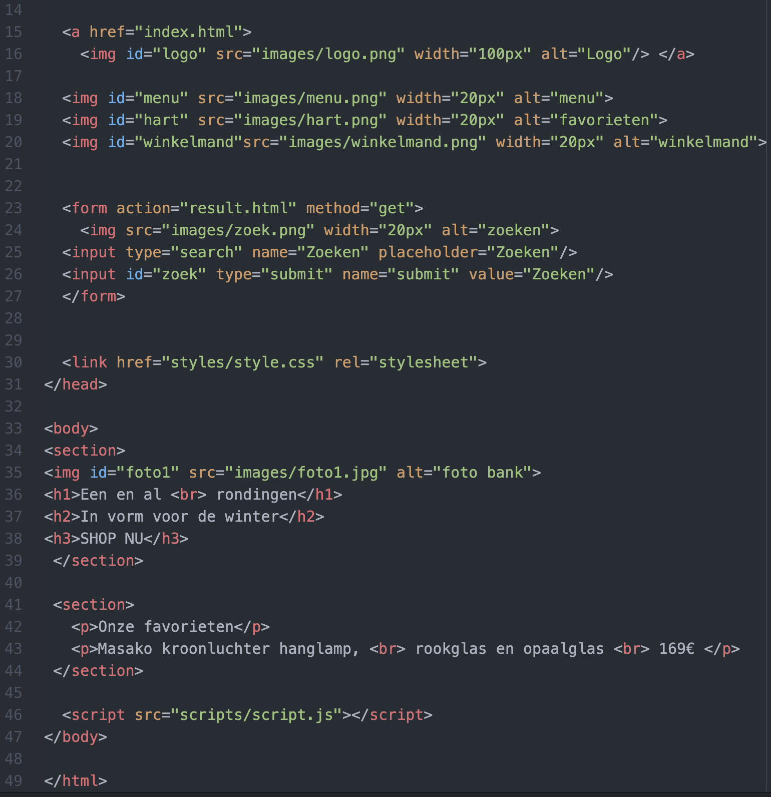 
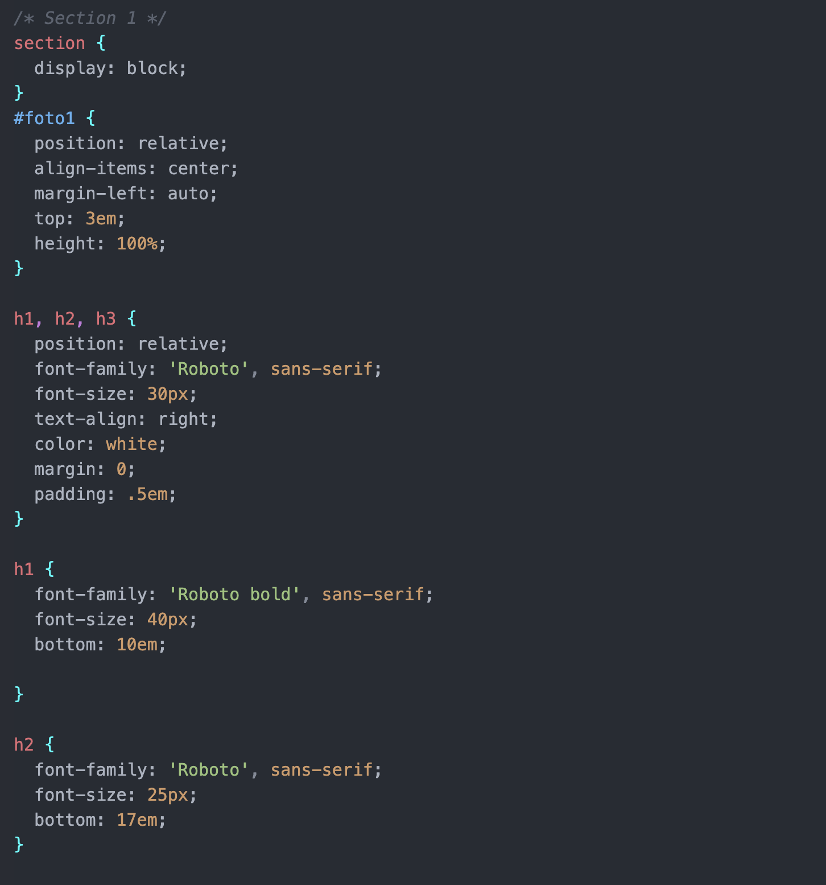 
Ik ben een beetje aan het uitzoeken hoe ik de sections moet opstellen, hiermee
bedoel ik hoe ik het goed onderelkaar krijg en of ik gewoon moet werken met top
en bottom.

### Agenda voor meeting

-samen met je groepje opstellen-

| student 1      | student 2          | student 3    | student 4        |
| ---            | ---                | ---          | ---              |
| dit bespreken  | en dit             | en ik dit    | en dan ik dat    |
| an dat ook nog | dit als er tijd is | nog een punt | dit wil ik zeker |
| ...            | ...                | ...          | ...              |

### Verslag van meeting

-na afloop snel uitkomsten vastleggen-

## Breakdownschets (week 1)

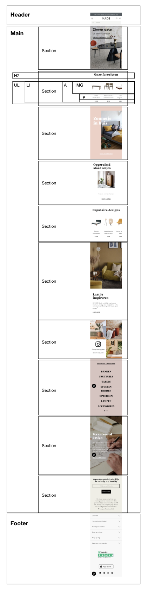
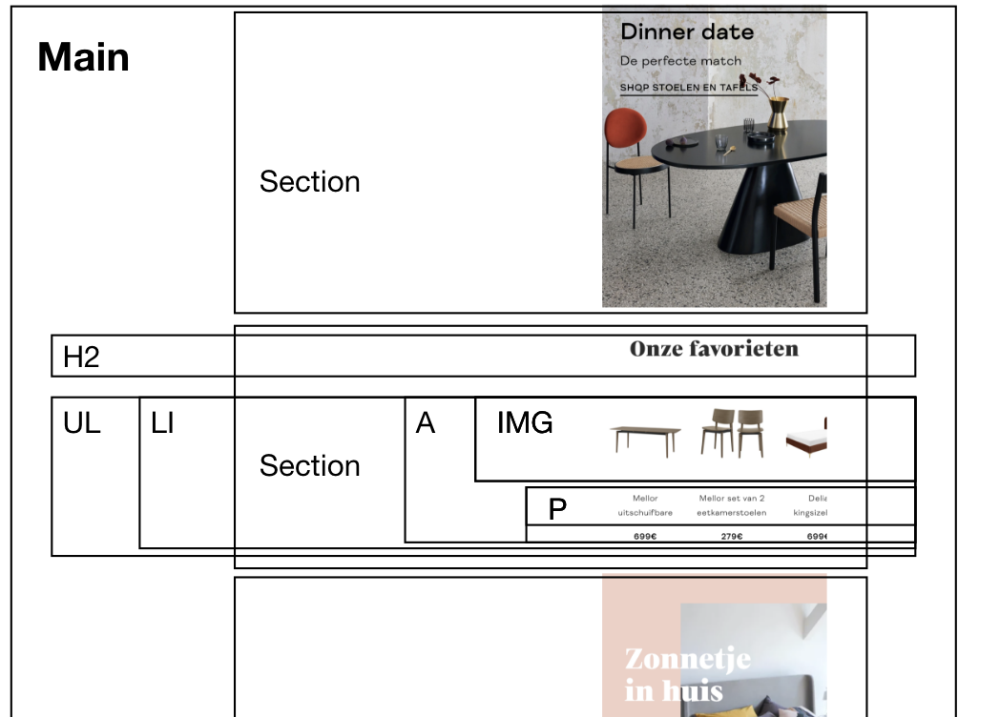

## Intake (week 1)

**Je startniveau:** -blauw-

**Je focus:** -responsive-

**Je opdracht:** -https://www.made.com/nl/-

**Screenshot(s) van de eerste pagina (small screen):**

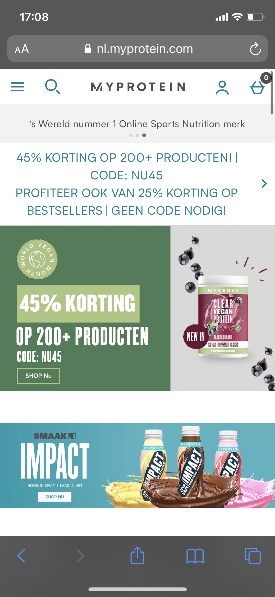

**Screenshot(s) van de tweede pagina (small screen):**

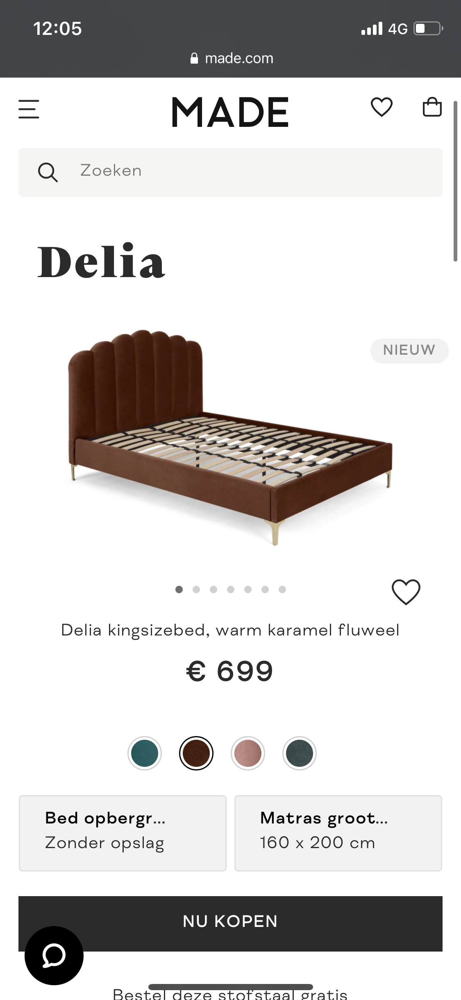
